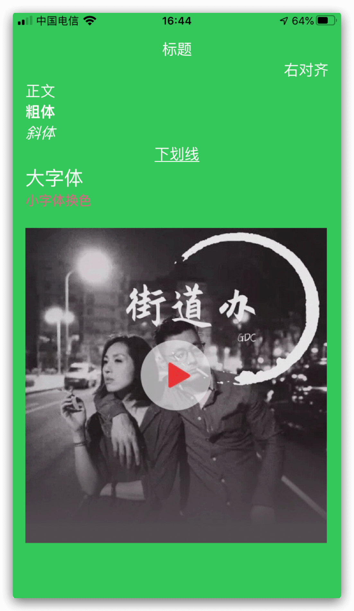
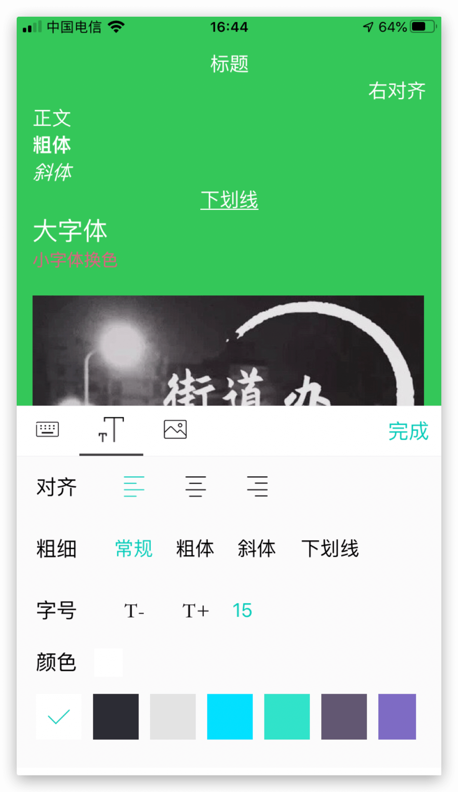

## YYRichEditor

[]() &nbsp;
[]() &nbsp;

## 介绍
- [x] OC开发，如需Swift可自行翻译
- [x] 支持常见的文本编辑操作如：文本对齐、粗体、斜体、下划线、文字大小、文字颜色，详情请见Demo
- [x] 支持运行于iOS、iPad上

## 演示

| 图1 | 图2
|------------|------------
|  |

## 集成方法
1. 下载Demo项目，将YYRichEditor文件夹拖入工程中
2. 在需要加入编辑器的界面加入代码：

```objc
    self.textVc = [[YYTextViewController alloc] init];
    self.textVc.delegate = self;
    [self addChildViewController:self.textVc];
    [self.view addSubview:self.textVc.view];
    [self.textVc.view mas_makeConstraints:^(MASConstraintMaker *make) {
        make.edges.equalTo(self.view);
    }];
```
3. 实现`YYRichEditorDelegate`代理：

```objc
- (void)yy_editorDoneWithContentArray:(NSArray <YYTextItem *> *)contentArray originString:(NSString *)string;
- (NSString *)yy_saveImage:(UIImage *)image;
```

4. 其他自定义配置查看`YYConfig.h`，最后运行查看效果。

